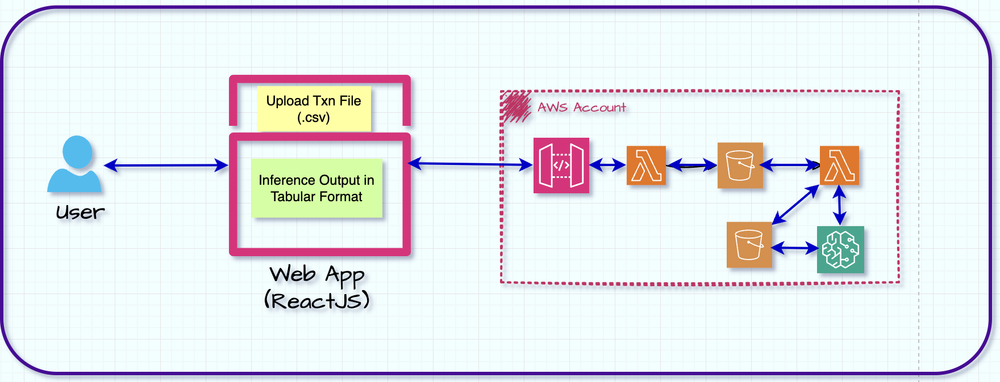
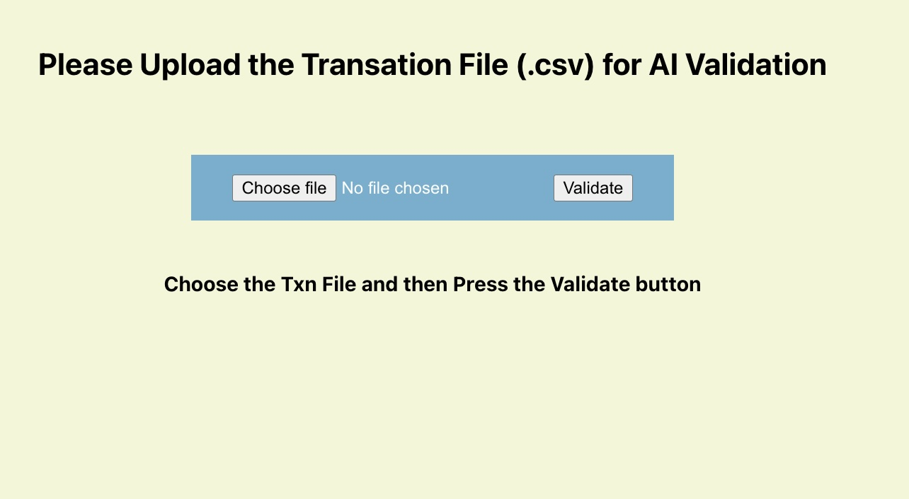
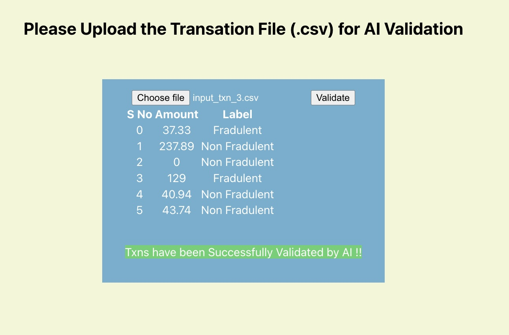

# **<u>Fraudulent Transaction Detection App</u>**

Welcome to the Transaction Detection App, a GenAI-based application for
detecting fraudulent transactions using the CT-GAN machine learning
model.

**Overview**

This application allows users to upload transaction data in a .csv file
through a user-friendly web interface. Once the transaction file is
uploaded, the app triggers the AWS S3 upload action using a POST API
endpoint. Subsequently, an inference Lambda function is invoked to
classify the uploaded transactions as fraudulent or non-fraudulent. The
results of the inference are then displayed on the web browser through a
GET API call.

**Technologies Used**

- **GenAI (GAN):** The application leverages Generative Adversarial
  Networks (GANs) for transaction classification, specifically using the
  CT-GAN machine learning model.

- **Python:** The backend logic and machine learning model are
  implemented using Python.

- **AWS Services:**

  - **AWS S3:** Used for storing and managing the uploaded transaction
    files.

  - **AWS API Gateway:** Manages the API endpoints for triggering S3
    upload and receiving inference results.

  - **AWS Lambda:** Executes the inference function upon S3 upload
    trigger.

  - **AWS IAM:** Manages access permissions for the AWS services.

- **Frontend:**

  - **ReactJS:** A JavaScript library for building the user interface.

  - **HTML5:** Markup language for structuring the web page.

  - **CSS3:** Stylesheet language for enhancing the visual presentation.

**Usage**

1.  Access the web interface and upload your transaction data in a .csv
    file.

2.  The app will trigger the AWS S3 upload action to store the
    transaction file.

3.  The uploaded file triggers the inference Lambda function for fraud
    detection.

4.  View the results on the web browser through a GET API call,
    displaying transaction amounts and their corresponding labels
    (Fraudulent/Non-Fraudulent).

**Solution Architecture Diagram**

**APP UI**

